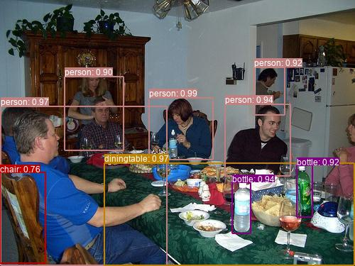

# TensorFlow implementation of Object Detection Models

Object Detection is the task of detecting and localizing instances of objects of certain classes (e.g. dogs, cars, tables) in digital images or videos. An object detector can automatically draw bounding boxes that tightly enclose the detected instances, and label each box with the predicted object class and a confidence score. Some object detectors can even add pixel-wise instance masks (aka instance segmentation), providing visually more informative annotations.

<p align="center "></p>

This is a TensorFlow-based implementation of object detection models. The main feature is that it combines *multiple* models into a single framework by abstracting out the common submodules such as the anchor (i.e. *A prior* guesses of bounding boxes) generation, the matching between anchors and groundtruth boxes, the assignment of prediction targets to anchors, and the post-processing of detections etc., so that they can be reused across different object detectors. The flexibility here allows one to add additional models with minimial effort.

Currently, Single Shot Detector (SSD) and Faster R-CNN are implemented in this framework.  

## Install
This implementation requires the following libraries or tools to be installed
* Protocol Buffer
* COCO API (optional)
* tf.slim
* PIL (for drawing bounding boxes and labels)
 
### Installing Protocol Buffer
Object detection models have way too many hyperparameters and settings to configure, which makes it cumbersome to pass them all as command line arguments. [Protocol Buffer](https://developers.google.com/protocol-buffers/) is used instead to manage the configuration of model settings -- You only need to prepare a few text files with extension `.config` (examples here) holding the parameters and settings you wish to be used, and pass the names of these text files as command line arguments.

Follow this [link](https://developers.google.com/protocol-buffers/docs/downloads) for instructions about downloading and installing Protocal Buffer compiler. You should be able to run `protoc --help` in the bash shell if installation was successful.

### Installing this repository 

You can clone this repository by running

```bash
git clone git@github.com:chao-ji/tf-detection.git detection
```

You need to make sure that the parent directory `mydir`

```
mydir
+---- detection
```

is on the Python search path list by adding
```bash
PYTHONPATH=$PYTHONPATH:/path_to_mydir/mydir
```

to file `.bashrc` or `.bash_profile` found in your home directory.

You should be able to run `import detection` in the Python interactive shell if installation was successful.
### Compile the Protbuf messages
Protocol Buffer messages are the text files with extension `.proto`, located under the folder `protos`. They store the schemas by which the `.config` text files are parsed. Protobuf messages must be compiled before being used.

To compile, run

```bash
mydir $ protoc detection/protos/*.proto --python_out=.
```
under the directory `mydir`.

You should get one `*_pb2.py` file for each `*.proto` file if compilation was successful.

### Installing COCO API
[COCO API](https://github.com/cocodataset/cocoapi) is needed only if you wish to use the [COCO dataset](http://cocodataset.org/#download) or compute the [COCO detection metrics](http://cocodataset.org/#detection-eval). To install COCO API, run 

```bash
git clone https://github.com/cocodataset/cocoapi.git
```
```bash
cd cocoapi/PythonAPI
```
```bash
PythonAPI $ make 
```
Next, make a symbolic link to the folder `pycocotools` under `mydir`
```bash
ln -s pycocotools /path_to_mydir/mydir/pycocotools
```
You should be able to run `import pycocotools` in the Python interactive shell if installation was successful. 


### Installing tf.slim
`tf.slim` is a library built on top of TensorFlow that includes the implementation of a number of Convolutional Neural Networks. It is used to build feature extractors for object detection models.

Follow this [link](https://github.com/tensorflow/models/tree/master/research/slim#installation) for instructions about installing `tf.slim`.

You can download the [checkpoints](https://github.com/tensorflow/models/tree/master/research/slim#pre-trained-models) holding the weights of those pre-trained ConvNet classification models.

Currently the following models are supported as feature extractor:
* [resnet-v1-101](http://download.tensorflow.org/models/resnet_v1_101_2016_08_28.tar.gz), for Faster R-CNN
* [mobilenet-v2](//storage.googleapis.com/mobilenet_v2/checkpoints/mobilenet_v2_1.0_224.tgz), for SSD
* [inception-v2](http://download.tensorflow.org/models/inception_v2_2016_08_28.tar.gz), for SSD and Faster R-CNN


## Usage

### Preparing the inputs

This framework assumes that the input images and their annotations are in [TFRecord](https://medium.com/ymedialabs-innovation/how-to-use-tfrecord-with-datasets-and-iterators-in-tensorflow-with-code-samples-ffee57d298af) format. Python scripts are provided for converting raw image files and annotations files into `.tfrecord` format. 

#### Pascal VOC dataset
The Pascal VOC dataset can be downloaded at:
* [Pascal VOC 2007 train/val splits](http://host.robots.ox.ac.uk:8080/pascal/VOC/voc2007/VOCtrainval_06-Nov-2007.tar) 
* [Pascal VOC 2007 test split](http://host.robots.ox.ac.uk:8080/pascal/VOC/voc2007/VOCtest_06-Nov-2007.tar)
* [Pascal VOC 2012 train/val splits](http://host.robots.ox.ac.uk:8080/pascal/VOC/voc2012/VOCtrainval_11-May-2012.tar)

After untar'ing these files, your folders should be organized like this:

```
pascal_data
+---------- TrainVal
|           +------- VOCdevkit
|                    +-------- VOC2007
|                    |         +------ Annotations
|                    |         |
|                    |         +------ JPEGImages
|                    |         |
|                    |         +------ ImageSets
|                    |   
|                    +-------- VOC2012   
|                              +------ Annotations
|                              |
|                              +------ JPEGImages
|                              |
|                              +------ ImageSets 
|
+---------- Test 
|           +--- VOCdevkit
|                +-------- VOC2007
|                          +------ Annotations
|                          |
|                          +------ JPEGImages
|                          |
|                          +------ ImageSets
```

Suppose that the full path to the parent directory `pascal_data` is `/path_to_pascal_data/pascal_data`. Run 

```bash
python create_pascal_voc.py --pascal_data_dir=/path_to_pascal_data/pascal_data
```
to convert the train/val splits of Pascal VOC 2007 and 2012, and test split of Pascal VOC 2007 into `.tfrecord` files. Set the flag `--ignore_difficult=True` to exclude difficult instances.

--------------------

The following `.config` files need to be configured for training, evaluating, inference and visualization:
* `label_map.config`: the mapping between object class index and object class name 
* `model.config`: the forward pass (i.e the anchor generator, feature extractor, hyperparameters for convolutional layers, etc.), post processing, target assigner, losses
* `dataset.config`: the decoder of the raw `.tfrecord` file, the data augmentation options
* `train_config.config`: the optimizer, learning rate schedule, the input `.tfrecord` files, the checkpoint of a classification model to restore variables from
* `test_config.config`: the evaluation metrics (i.e. PASCAL VOC or COCO), the checkpoint of a trained object detector to restore variables from, the options for visualization

Examples can be found [here].

### Training 
To train an object detector, run
```
  python run_trainer.py \
    --label_map_config_path=label_map.config \
    --model_config_path=model.config \
    --dataset_config_path=dataset.config \
    --train_config_path=train_config.config \
    --model_arch=MODEL_ARCH
```
`MODEL_ARCH` can be `ssd_model` or `faster_rcnn_model`.

You need to specify the paths to the `.tfrecord` files for training using the `input_file` option in the `train_config.config` file. The checkpoint files holding the trained variables are located in the folder specified by the `save_ckpt_path` option in the `model.config` file.

### Evaluation

```
  python run_inferencer.py \
    --label_map_config_path=label_map.config \
    --model_config_path=model.config \
    --dataset_config_path=dataset.config \
    --test_config_path=test_config.config \
    --model_arch=MODEL_ARCH
```
You need to specify the paths to the `.tfrecord` files for evaluation using the `input_file` option in the `test_config.config` file. The evaluation metrics will be printed to stdout.

### Inference and Visualization


To make detection inference on input images using a trained model, run
```
  python run_inferencer.py \
    --label_map_config_path=label_map.config \
    --model_config_path=model.config \
    --dataset_config_path=dataset.config \
    --test_config_path=test_config.config \
    --model_arch=MODEL_ARCH
```
You need to place the input images (e.g. `.jpg`) under the folder specified by the `inference_directory` option in  the `test_config.config` file. The detected bounding boxes (i.e. coordinates, class labels and confidence scores) are saved in `.npy` files, one for each `.jpg` image file with the same base name (i.e. `dog.npy` for `dog.jpg`).


To draw the detected boxes already inferred, run
```
  python run_inferencer.py \
    --label_map_config_path=label_map.config \
    --model_config_path=model.config \
    --dataset_config_path=dataset.config \
    --test_config_path=test_config.config \
    --model_arch=MODEL_ARCH
```
The images annotated with predicted boxes are named as `dog.jpg` for the `dog.npy` file.


## Experiments


### Pascal VOC dataset
The following combinations of object detector and feature extractor were trained on the union of the `trainval` splits of Pascal VOC 2007 and `trainval` splits of VOC 2012, and were evaluated on the VOC 2007 `test` split. The goal is to achieve comparable results prepresented in the respective papers so similar parameter settings were used.


**AP\@0.5IOU**: a detected box is considered as true positive if it overlaps a groundtruth box of the same object class with IOU >= 0.5.

object detector|SSD|SSD|Faster R-CNN|Faster R-CNN|
-|-|-|-|-|
**feature extractor**|**inception-v2**|**mobilenet-v2**|**inception-v2**|**resnet-v1-101**
**mAP**| **0.7355**|**0.6839**|**0.7773**|**0.7827**
aeroplane| 0.7829| 0.7355|0.8095|0.8298
bicycle| 0.7895| 0.7646|0.8509|0.8750
bird| 0.6967| 0.6537|0.8203|0.8143
boat| 0.6326| 0.5627|0.6911|0.7127
bottle| 0.4173| 0.2707|0.6145|0.6427
bus| 0.8605| 0.8088|0.8631|0.8806
car| 0.7983| 0.7673|0.8819|0.8942
cat| 0.8758| 0.8859|0.9182|0.9061
chair| 0.5017| 0.4255|0.5212|0.5318
cow| 0.7350| 0.7149|0.8157|0.8049
diningtable| 0.7464| 0.6770|0.6112|0.6162
dog| 0.8731| 0.8187|0.9123|0.8930
horse| 0.8805| 0.8466|0.9037|0.8919
motorbike| 0.8173| 0.8002|0.8273|0.8464
person| 0.7633| 0.7175|0.8531|0.8547
pottedplant| 0.4492| 0.3749|0.4849|0.4949
sheep| 0.7303| 0.6488|0.8275|0.8207
sofa| 0.7658| 0.7220|0.7394|0.7361
train| 0.8814| 0.8422|0.8553|0.8411
tvmonitor| 0.7132| 0.6404|0.7442|0.7666


### COCO dataset


# References

* Official TensorFlow Object Detection API
* Fast R-CNN
* Faster R-CNN
* SSD
