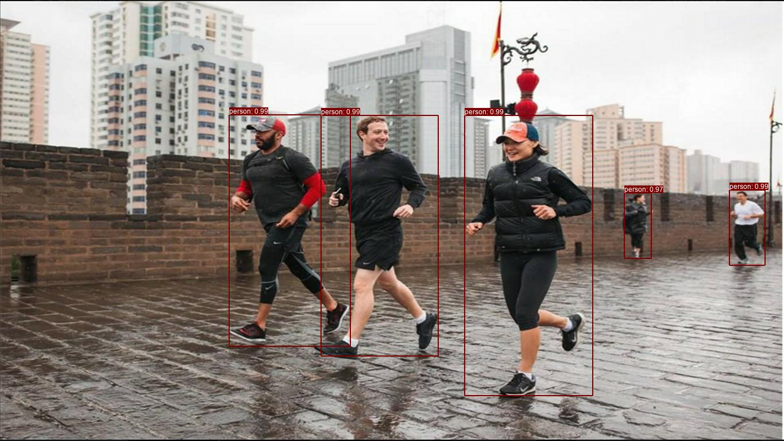
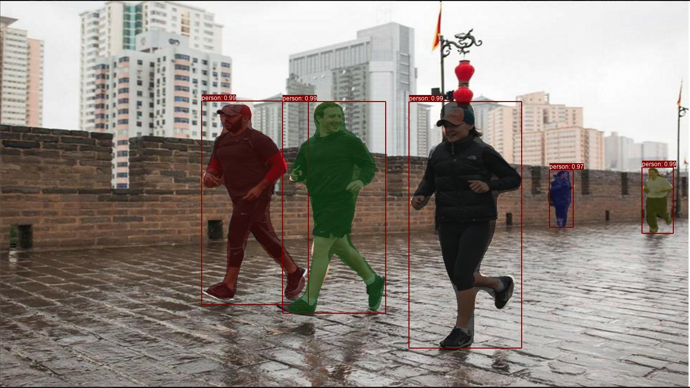
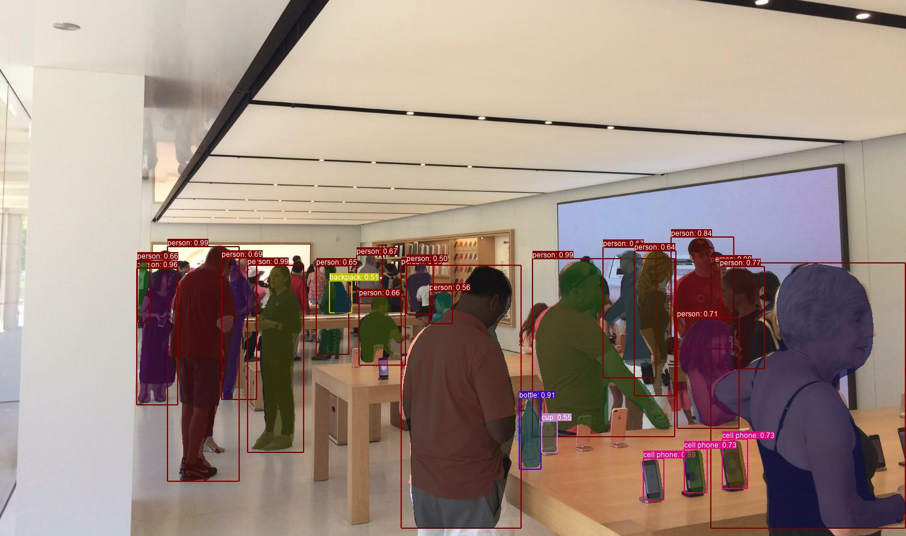
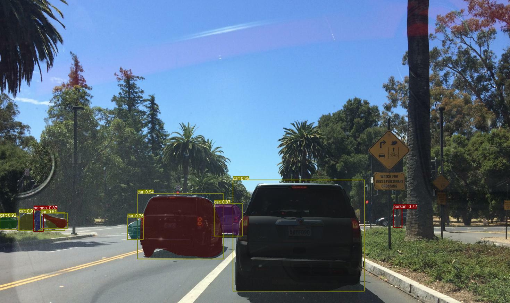
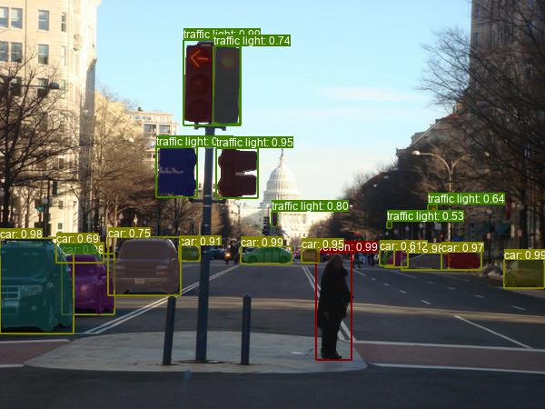

# TensorFlow implementation of Object Detection Models

Object Detection is the task of localizing and classifying instances of objects of certain classes (e.g. dogs, cars, tables) in digital images or videos. An object detector can automatically draw bounding boxes that tightly enclose the detected instances, and label each instance with the predicted object class and a confidence score. Some object detectors can even add pixel-wise instance masks (aka instance segmentation), providing visually more informative annotations.

   

  
   
  Top: Object Detection (outputs bounding box); Bottom: Instance Segmentation (outputs instance mask on top of bounding box)

This repository contains tensorflow implementations of **multiple** modern (i.e. convolutional neural network based) object detection systems. The idea is that object detection systems are usually composed of multiple modules (data augmentation, anchor generation, target assignment, non maximum suppression, etc.), and most of the time they can be reused across different models (e.g. SSD, YOLO, Faster R-CNN). The flexibility allows one to maintain existing and add additional models with minimal effort.

As of June 2019, Single Shot Detector (SSD), Faster R-CNN, and Mask R-CNN are implemented in this repository.  

**Highlights**

* Use [ROI Align](https://chao-ji.github.io/jekyll/update/2018/07/20/ROIAlign.html) in both Faster R-CNN and Mask R-CNN.
* Supports [bucheted batching](g3doc/Usage.md#bucketed-batching) for batching images of different sizes, which minimizes the amount of padding.

## Table of Contents

* [Installation](g3doc/Installation.md)
* [Usage](g3doc/Usage.md)
* [Experiments](#Experiments)
* [Acknowledgements](#Acknowledgements)

## Experiments

This section presents results of training and evaluating object detection (and instance segmentation) models on public datasets.

### Object Detection

#### Pascal VOC dataset
The following combinations of object detector and feature extractor were trained on the union of **trainval** of VOC2007 and **trainval** of VOC2012, and were evaluated on the **test** of VOC2007. 

object detector|SSD|SSD|Faster R-CNN|Faster R-CNN|
-|-|-|-|-|
**feature extractor**|**inception-v2**|**mobilenet-v2**|**inception-v2**|**resnet-v1-101**
**mAP**| **0.7355**|**0.6839**|**0.7773**|**0.7827**
aeroplane| 0.7829| 0.7355|0.8095|0.8298
bicycle| 0.7895| 0.7646|0.8509|0.8750
bird| 0.6967| 0.6537|0.8203|0.8143
boat| 0.6326| 0.5627|0.6911|0.7127
bottle| 0.4173| 0.2707|0.6145|0.6427
bus| 0.8605| 0.8088|0.8631|0.8806
car| 0.7983| 0.7673|0.8819|0.8942
cat| 0.8758| 0.8859|0.9182|0.9061
chair| 0.5017| 0.4255|0.5212|0.5318
cow| 0.7350| 0.7149|0.8157|0.8049
diningtable| 0.7464| 0.6770|0.6112|0.6162
dog| 0.8731| 0.8187|0.9123|0.8930
horse| 0.8805| 0.8466|0.9037|0.8919
motorbike| 0.8173| 0.8002|0.8273|0.8464
person| 0.7633| 0.7175|0.8531|0.8547
pottedplant| 0.4492| 0.3749|0.4849|0.4949
sheep| 0.7303| 0.6488|0.8275|0.8207
sofa| 0.7658| 0.7220|0.7394|0.7361
train| 0.8814| 0.8422|0.8553|0.8411
tvmonitor| 0.7132| 0.6404|0.7442|0.7666

#### COCO dataset
The following combinations of object detector and feature extractor were trained on the train2017 split (118k images) of COCO dataset, and evaluated on val2017 split (5k images).

object detector |SSD|Faster R-CNN|
-|-|-|
**feature extractor**|**inception-v2**|**inception-v2**|
AP\@0.50:0.95 |**0.205**| **0.275** |
AP\@0.50 |0.359| 0.472 |
AP\@0.75 |0.203| 0.280 | |
AP\@0.50:0.95(S) |0.014| 0.056 |
AP\@0.50:0.95(M) |0.103| 0.245 |
AP\@0.50:0.95(L) |0.377| 0.422 |

See [ssd](configs/ssd/) and [faster_rcnn](configs/faster_rcnn/) for the full hyperparameter settings.

### Instance Segmentation

#### COCO dataset
Since PASCAL VOC dataset does not provide instance masks, so Mask R-CNN was trained and evaluated on COCO dataset (2017).

Hyperparameters:
* Backbone: resnet101-v1 with output stride 8
* Anchor: four scales (0.25, 0.5, 1.0, 2.0) and three aspect ratios (0.5, 1.0, 2.0)
* Mask size: 33 x 33
* Num of convolutional layers in the mask prediction branch: 4
* Max num of proposals by NMS: 300
* Batch size: one image per minibatch
* Data augmentation: random horizontal flip
* learning rate schedule: fixed learninng rate 2e-4 for 1.6M minibatches, and then 2e-5 for an additional 0.8M minibatches
* Optimizer: SGD w/ momentum 0.9

See [this](configs/mask_rcnn) for the full hyperparameter settings. The checkpoint of the trained model is available at [download](https://www.dropbox.com/sh/bnj0rcijn1q4xih/AADjwqxcHWNpBnPwo5bRq7Kta?dl=0).

**Note**: both box AP and mask AP are used as evaluation metric since Mask R-CNN outputs both boxes and instance masks.

object detector |Mask R-CNN|Mask R-CNN|
-|-|-|
**feature extractor**|**resnet101-v1**|**resnet101-v1**|
metrics|mask AP| box AP|
AP\@0.50:0.95 |**0.3181**|0.3490|
AP\@0.50 |0.5178|0.5491|
AP\@0.75 |0.3365|0.3789|
AP\@0.50:0.95(S) |0.0889|0.1280|
AP\@0.50:0.95(M) |0.2941|0.3349|
AP\@0.50:0.95(L) |0.4693|0.4770|

The trained model was evaluated on the val split of COCO 2017 (5k images). The mask AP was 0.318, which is comparable to the mask AP of 0.327 (evaluated on the same validation set) reported in the Mask R-CNN paper (Table 2a). The model was trained for 2.4M minibatches (took > 500 hrs on my single GPU machine), and it is possible to see better performance if trained for more iterations. 

##### Sample Outputs

  

  

  

## Acknowledgements
This implementation was inspired by and borrows code from the Official TensorFlow Object Detection API. My goal was to thoroughly understand how object detection models work, and the best way to achieve this is by building rather than just reading papers and blog posts. However, a lot of implementation details are left out in most papers, and one would need a reference implementation to understand exactly how different modules (e.g. anchor generation, target assignments for anchors/proposals, non-maximum suppression, etc.) work. The offical Tensorflow object detection API provides implementaions of most popular object detection models in the literature (the other being Detectron from Facebook Research), and uses Protocol buffer to manage hyperparameter settings, and uses abstractions of `BoxList` (for groundtruth boxes, anchors, and proposals), `BoxPredictor` and `BoxCoder`, which are also adopted in this repository. 

## References

* [Official TensorFlow Object Detection API](https://github.com/tensorflow/models/tree/master/research/object_detection)
* Fast R-CNN, [arxiv1504.08083](https://arxiv.org/abs/1504.08083)
* Faster R-CNN, [arxiv1506.01497](https://arxiv.org/abs/1506.01497)
* Mask R-CNN [arxiv1703.06870](https://arxiv.org/abs/1703.06870)
* SSD, [arxiv1512.02325](https://arxiv.org/abs/1512.02325)
* COCO dataset, [http://cocodataset.org/#home](http://cocodataset.org/#home)
* PASCAL VOC dataset, [http://host.robots.ox.ac.uk:8080/pascal/VOC/index.html](http://host.robots.ox.ac.uk:8080/pascal/VOC/index.html)
